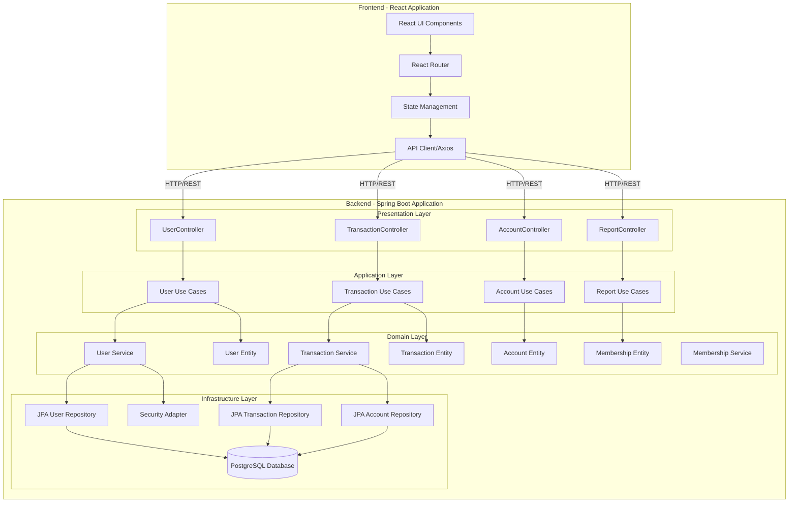
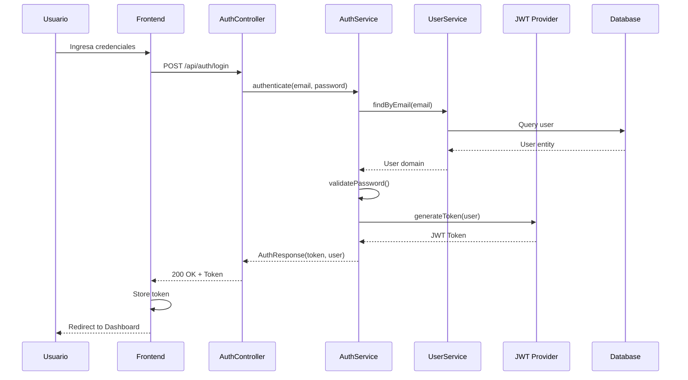
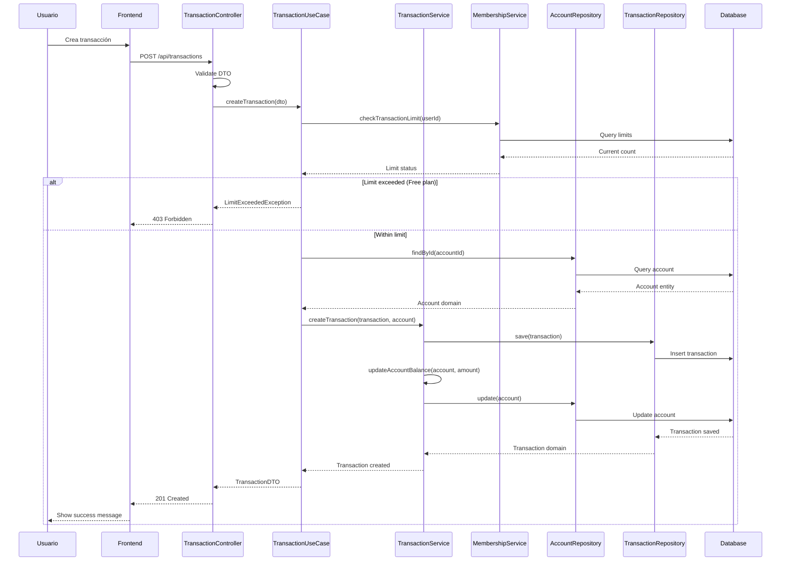
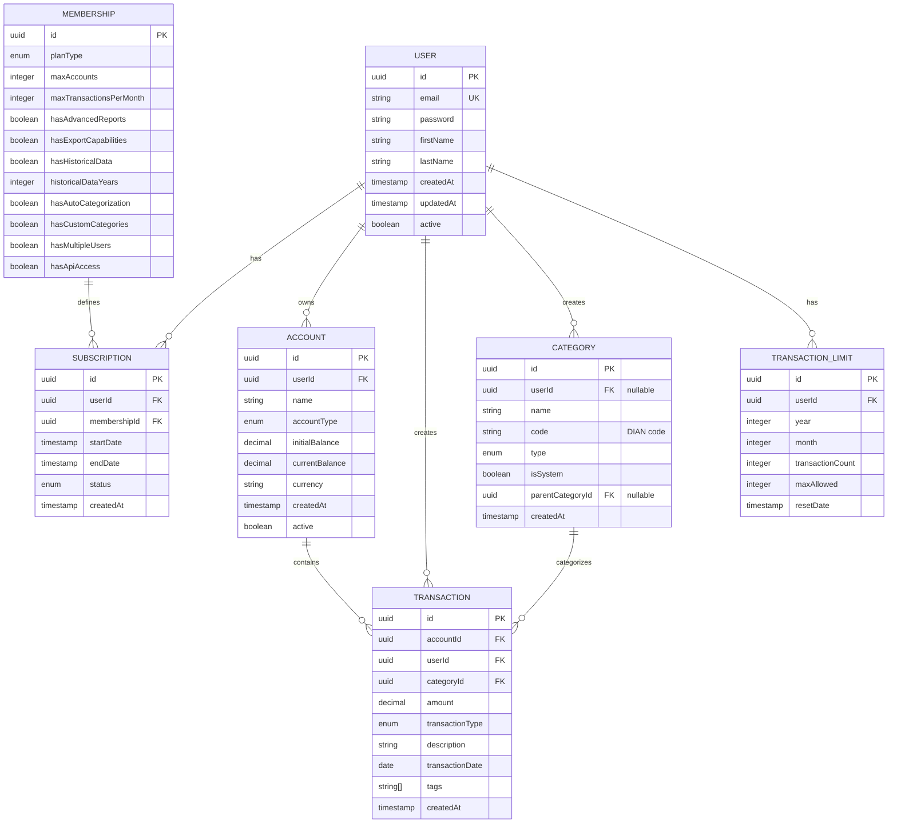
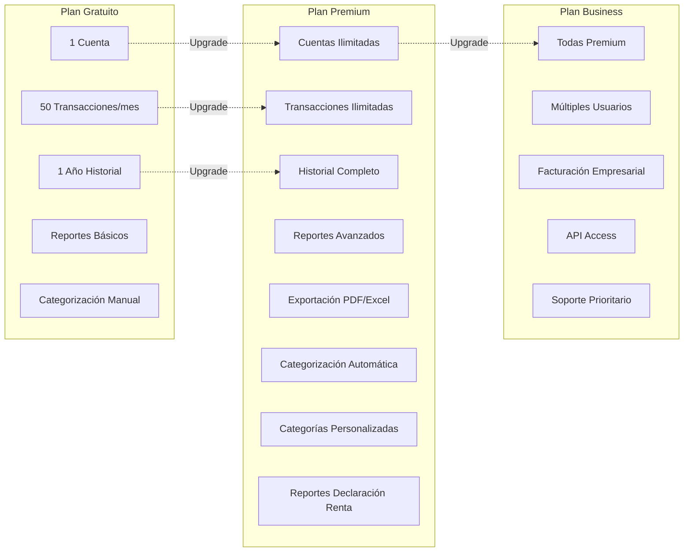
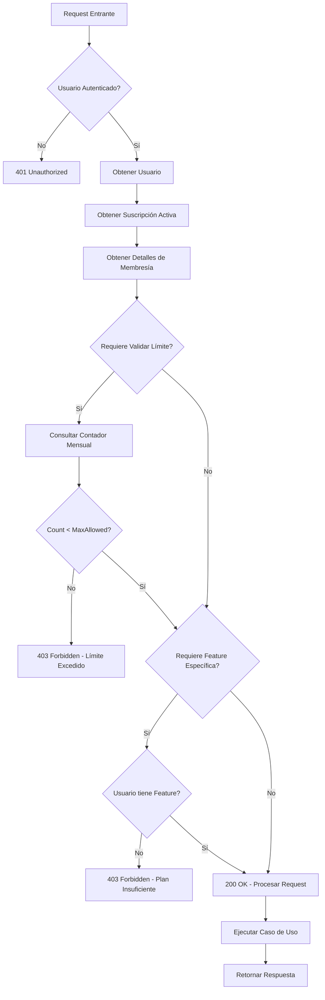
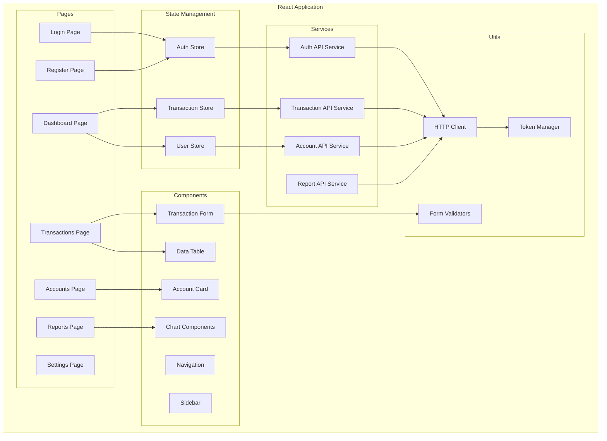
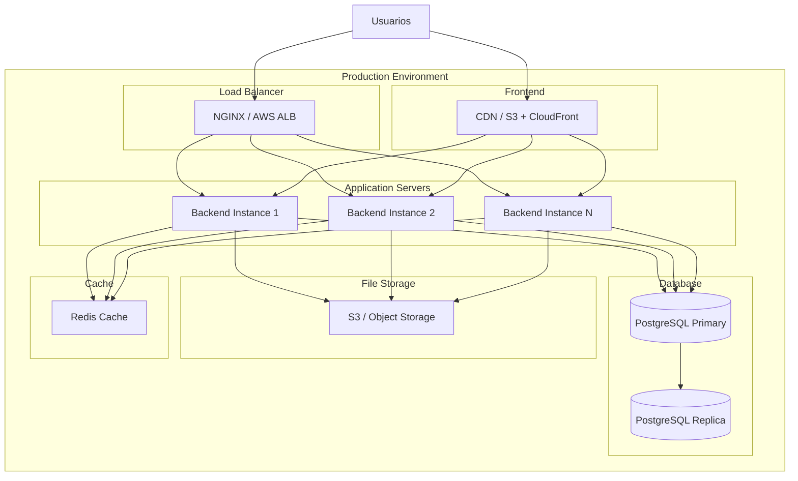
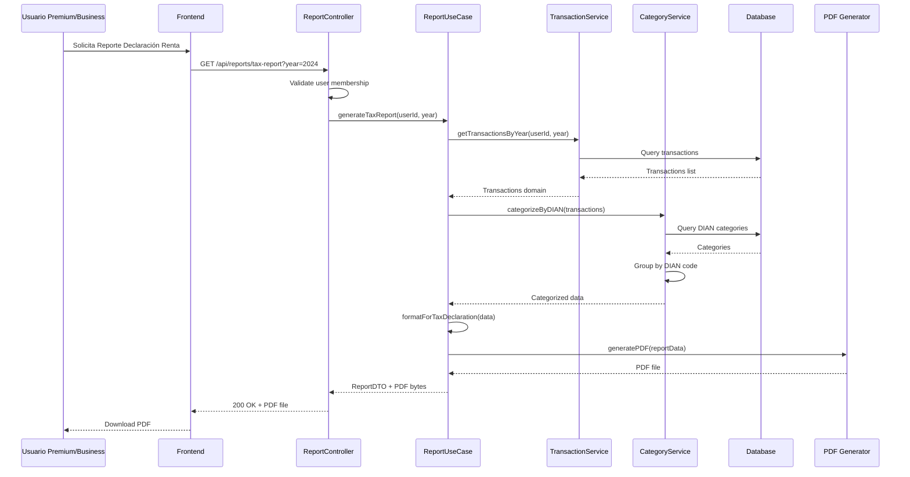

# Documentación de Arquitectura - DevalFinance

## Diagrama de Arquitectura Hexagonal Completo

### Vista General del Sistema



## Diagrama de Flujo de Autenticación



## Diagrama de Flujo de Creación de Transacción



## Diagrama de Modelo de Datos (ERD)



## Diagrama de Permisos y Límites por Plan



## Flujo de Validación de Permisos



## Diagrama de Componentes del Frontend



## Arquitectura de Deployment (Futuro)



## Flujo de Generación de Reporte de Declaración de Renta



---

## Notas sobre la Arquitectura

### Principios Aplicados

1. **Separación de Responsabilidades:** Cada capa tiene una responsabilidad clara y única
2. **Inversión de Dependencias:** El dominio no depende de infraestructura
3. **Testabilidad:** Cada componente puede ser testeado de forma independiente
4. **Escalabilidad:** Preparado para migrar a microservicios sin cambiar el dominio
5. **Mantenibilidad:** Código organizado y fácil de entender

### Patrones de Diseño Utilizados

- **Repository Pattern:** Abstracción de acceso a datos
- **Use Case Pattern:** Encapsulación de lógica de negocio
- **DTO Pattern:** Transferencia de datos entre capas
- **Adapter Pattern:** Adaptación de interfaces externas
- **Strategy Pattern:** Para diferentes algoritmos de reportes
- **Factory Pattern:** Para creación de entidades complejas

### Decisiones Arquitectónicas

1. **Arquitectura Hexagonal:** Elegida por su flexibilidad y testabilidad
2. **Monolítico Modular:** Empezamos monolítico pero con módulos bien separados
3. **API REST:** Estándar de la industria para comunicación frontend-backend
4. **JWT para Autenticación:** Stateless y escalable
5. **PostgreSQL:** Base de datos relacional robusta y open-source

### Estructura de Paquetes

```
src/main/java/com/devalFinance/
├── domain/                    # CORE - Sin dependencias externas
│   ├── model/                # Entidades de dominio
│   └── repository/           # Interfaces (Ports)
│
├── application/              # Casos de Uso
│   ├── usecase/
│   └── dto/
│
├── infrastructure/           # Adapters - Implementaciones
│   ├── persistence/
│   │   ├── entity/          # JPA Entities
│   │   ├── repository/      # Spring Data Repositories
│   │   └── adapter/         # Repository Adapters
│   ├── security/
│   └── config/
│
└── presentation/            # REST Controllers
    ├── controller/
    ├── mapper/
    └── exception/
```

### Flujo de Datos

1. **Request HTTP** → Controller (Presentation)
2. **Controller** → Valida entrada, convierte DTO a Domain
3. **Use Case** (Application) → Orquesta la lógica de negocio
4. **Domain Service** → Ejecuta reglas de negocio
5. **Repository Interface** (Port) → Definido en Domain
6. **Repository Adapter** (Infrastructure) → Implementa persistencia
7. **Database** → Almacena/recupera datos
8. **Response** → Flujo inverso hasta retornar DTO al cliente

---

## Ventajas de esta Arquitectura

1. **Testabilidad:** Fácil de testear cada capa independientemente
2. **Mantenibilidad:** Código organizado y fácil de entender
3. **Escalabilidad:** Preparado para crecer y migrar a microservicios
4. **Flexibilidad:** Fácil cambiar implementaciones sin afectar el dominio
5. **Clean Code:** Separación clara de responsabilidades
